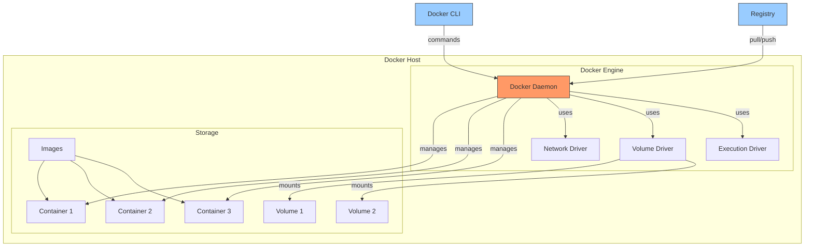
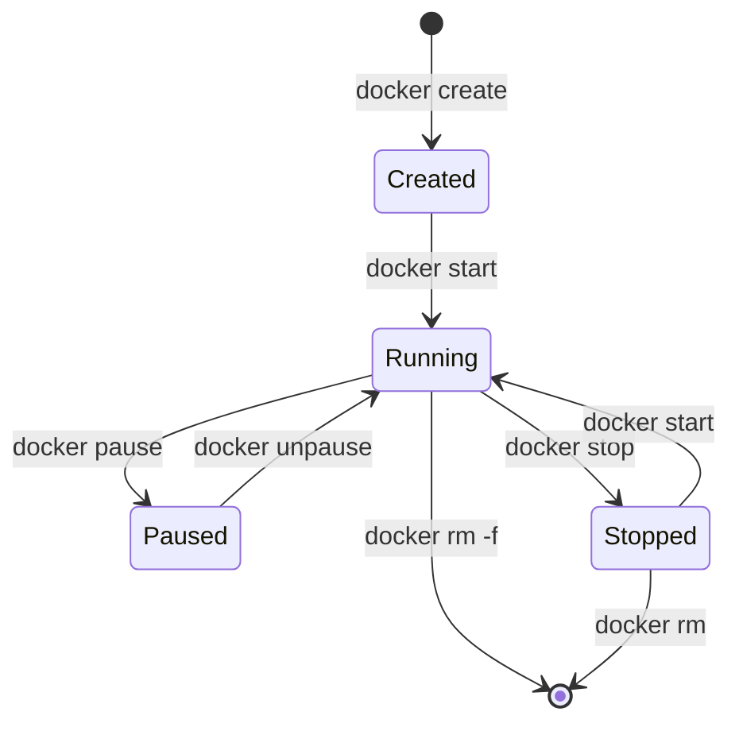
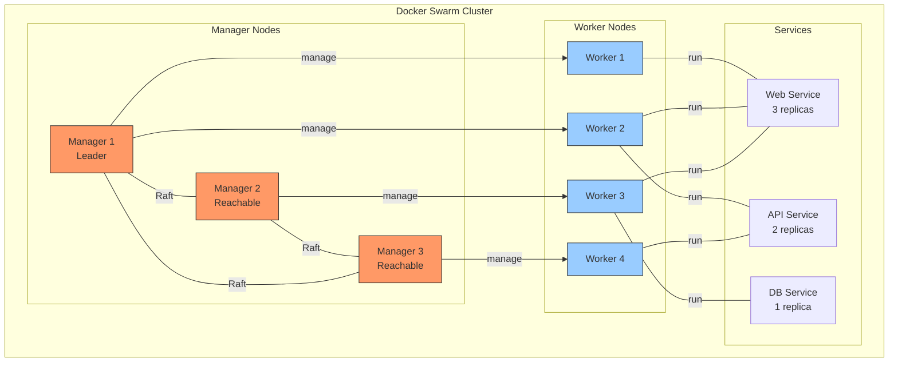
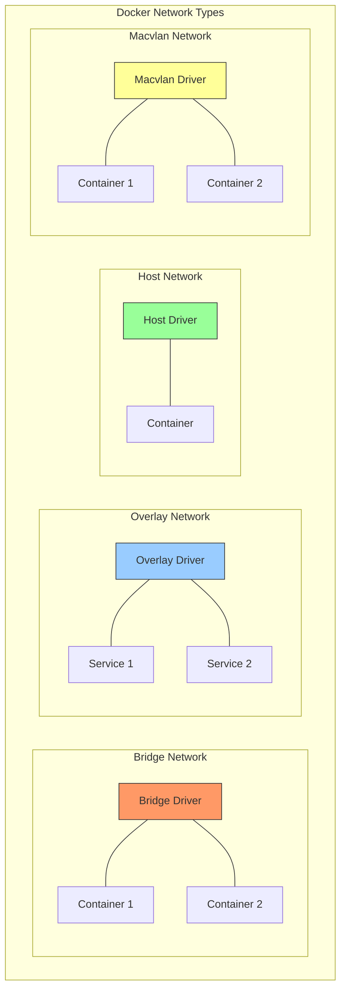

# Docker Installation and Configuration Guide

[← Back to SSL Setup](ssl-certificate.md) | [Next: Next.js Deployment →](nextjs-docker-deploy.md)

---

## Docker Architecture



## Container Lifecycle



## Table of Contents
1. [Prerequisites](#prerequisites)
2. [Docker Installation](#docker-installation)
3. [Post-Installation Setup](#post-installation-setup)
4. [Docker Compose Installation](#docker-compose-installation)
5. [Basic Configuration](#basic-configuration)
6. [Security Best Practices](#security-best-practices)

## Prerequisites

### System Requirements
- 64-bit processor
- Kernel version 3.10 or higher
- 4GB RAM minimum
- Supported operating systems:
  - Ubuntu 20.04/22.04 LTS
  - Debian 10/11
  - CentOS/RHEL 8/9
  - Rocky Linux 8/9

### Pre-Installation Steps
```bash
# Update system packages
# Ubuntu/Debian
sudo apt update && sudo apt upgrade -y

# RHEL/Rocky Linux
sudo dnf update -y

# Install required packages
# Ubuntu/Debian
sudo apt install -y \
    apt-transport-https \
    ca-certificates \
    curl \
    gnupg \
    lsb-release

# RHEL/Rocky Linux
sudo dnf install -y \
    dnf-utils \
    device-mapper-persistent-data \
    lvm2
```

## Docker Installation

### Ubuntu/Debian Installation
```bash
# Add Docker's official GPG key
curl -fsSL https://download.docker.com/linux/ubuntu/gpg | sudo gpg --dearmor -o /usr/share/keyrings/docker-archive-keyring.gpg

# Add Docker repository
echo "deb [arch=$(dpkg --print-architecture) signed-by=/usr/share/keyrings/docker-archive-keyring.gpg] https://download.docker.com/linux/ubuntu $(lsb_release -cs) stable" | sudo tee /etc/apt/sources.list.d/docker.list > /dev/null

# Install Docker
sudo apt update
sudo apt install -y docker-ce docker-ce-cli containerd.io
```

### RHEL/Rocky Linux Installation
```bash
# Add Docker repository
sudo dnf config-manager --add-repo https://download.docker.com/linux/centos/docker-ce.repo

# Install Docker
sudo dnf install -y docker-ce docker-ce-cli containerd.io

# Start and enable Docker service
sudo systemctl start docker
sudo systemctl enable docker
```

## Post-Installation Setup

### User Configuration
```bash
# Add user to docker group
sudo usermod -aG docker $USER

# Apply new group membership
newgrp docker

# Verify installation
docker --version
docker info
```

### Test Installation
```bash
# Run test container
docker run hello-world

# Check running containers
docker ps

# Check all containers
docker ps -a
```

## Docker Compose Installation

### Install Docker Compose
```bash
# Download latest version
sudo curl -L "https://github.com/docker/compose/releases/latest/download/docker-compose-$(uname -s)-$(uname -m)" -o /usr/local/bin/docker-compose

# Make executable
sudo chmod +x /usr/local/bin/docker-compose

# Verify installation
docker-compose --version
```

## Basic Configuration

### Docker Daemon Configuration
```bash
# Create daemon.json
sudo mkdir -p /etc/docker
sudo tee /etc/docker/daemon.json <<EOF
{
    "log-driver": "json-file",
    "log-opts": {
        "max-size": "10m",
        "max-file": "3"
    },
    "default-address-pools": [
        {
            "base": "172.17.0.0/16",
            "size": 24
        }
    ],
    "dns": ["8.8.8.8", "8.8.4.4"],
    "storage-driver": "overlay2"
}
EOF

# Restart Docker service
sudo systemctl restart docker
```

### Network Configuration
```bash
# Create custom network
docker network create --driver bridge my-network

# List networks
docker network ls

# Inspect network
docker network inspect my-network
```

### Storage Configuration
```bash
# Check current storage details
docker system df

# Clean up unused resources
docker system prune -a

# Configure storage location
sudo mkdir -p /data/docker
sudo tee /etc/docker/daemon.json <<EOF
{
    "data-root": "/data/docker"
}
EOF
```

## Security Best Practices

### Basic Security Configuration
```bash
# Set proper permissions
sudo chmod 660 /var/run/docker.sock

# Configure logging
sudo tee /etc/docker/daemon.json <<EOF
{
    "log-level": "info",
    "log-driver": "json-file",
    "log-opts": {
        "max-size": "10m",
        "max-file": "3"
    }
}
EOF
```

### Container Security
```bash
# Run container with security options
docker run -d \
    --name secure-container \
    --cap-drop ALL \
    --security-opt no-new-privileges \
    --read-only \
    --tmpfs /tmp \
    nginx:latest

# Scan container for vulnerabilities
docker scan nginx:latest
```

### Resource Limits
```bash
# Run container with resource limits
docker run -d \
    --name limited-container \
    --memory="512m" \
    --memory-swap="1g" \
    --cpus="1.5" \
    nginx:latest
```

### Firewall Configuration
```bash
# UFW (Ubuntu)
sudo ufw allow 2375/tcp
sudo ufw allow 2376/tcp

# Firewalld (RHEL/Rocky)
sudo firewall-cmd --permanent --add-port=2375/tcp
sudo firewall-cmd --permanent --add-port=2376/tcp
sudo firewall-cmd --reload
```

## Troubleshooting

### Common Issues
```bash
# Check Docker status
sudo systemctl status docker

# View Docker logs
sudo journalctl -fu docker

# Check container logs
docker logs container_name

# Inspect container
docker inspect container_name
```

### Maintenance Commands
```bash
# Remove unused images
docker image prune -a

# Remove unused volumes
docker volume prune

# Remove unused networks
docker network prune

# System cleanup
docker system prune -af --volumes
```

## Container Orchestration



## Docker Networking



## Next Steps
- Configure container orchestration
- Set up Docker registry
- Implement monitoring
- Configure backup strategy

---
*This guide will be updated with more detailed sections as we progress.* 