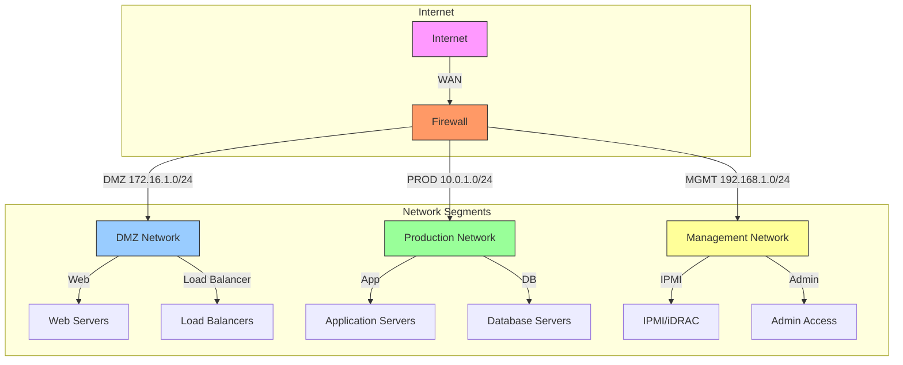
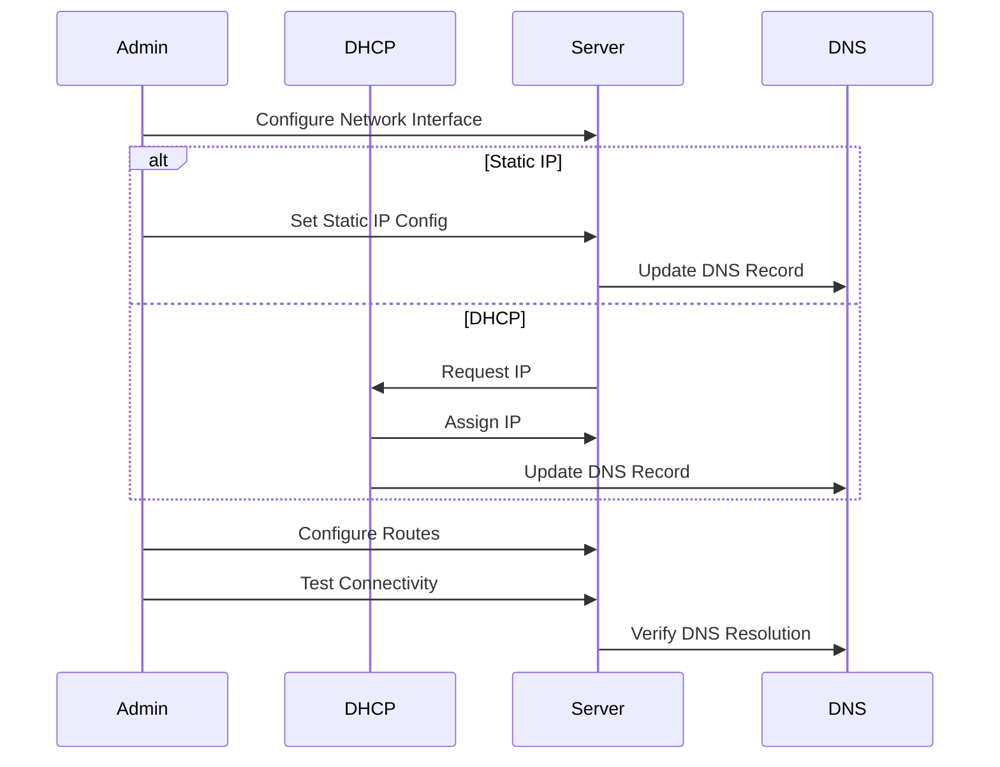
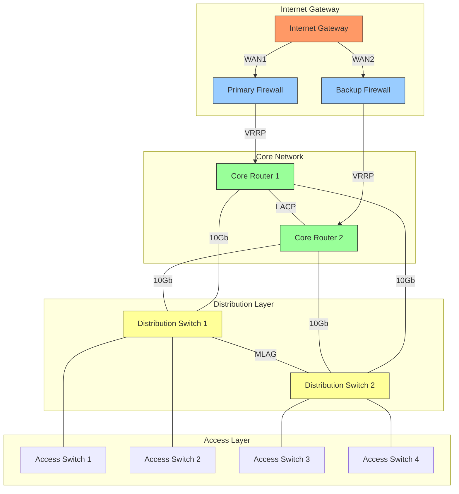
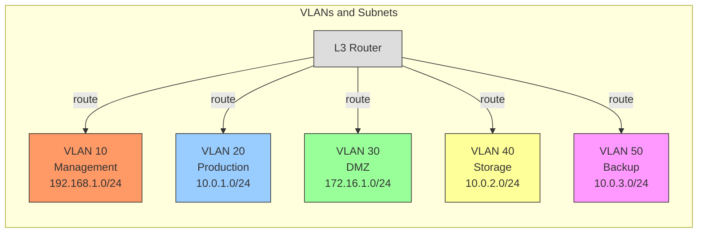

# IP Assignment and Network Configuration Guide

[← Back to Main Guide](README.md) | [Next: SSH Setup →](ssh-connection.md)

---

## Network Architecture



## IP Assignment Flow



# Server IP Assignment and Network Configuration Guide

## Table of Contents
1. [Network Planning](#network-planning)
2. [IP Assignment Methods](#ip-assignment-methods)
3. [Network Interface Configuration](#network-interface-configuration)
4. [Network Testing](#network-testing)
5. [Troubleshooting](#troubleshooting)

## Network Planning

### Network Segmentation
1. **Production Network**
   - Server farm network: 10.0.1.0/24
   - Application network: 10.0.2.0/24
   - Database network: 10.0.3.0/24

2. **Management Network**
   - IPMI/iDRAC: 192.168.1.0/24
   - Management interfaces: 192.168.2.0/24

3. **DMZ Network**
   - Public services: 172.16.1.0/24
   - Load balancers: 172.16.2.0/24

### IP Address Scheme
```plaintext
Server Naming Convention:
[location]-[role]-[number]
Example: dc1-web-01

IP Assignment Pattern:
Production Servers: 10.0.x.1xx
Management IPs:    192.168.x.1xx
DMZ Servers:      172.16.x.1xx
```

## IP Assignment Methods

### Static IP Configuration

1. **RHEL/Rocky Linux/CentOS**
   ```bash
   # /etc/sysconfig/network-scripts/ifcfg-ens160
   TYPE=Ethernet
   BOOTPROTO=none
   NAME=ens160
   DEVICE=ens160
   ONBOOT=yes
   IPADDR=10.0.1.101
   PREFIX=24
   GATEWAY=10.0.1.1
   DNS1=10.0.1.53
   DNS2=10.0.1.54
   ```

2. **Ubuntu/Debian (Netplan)**
   ```yaml
   # /etc/netplan/01-netcfg.yaml
   network:
     version: 2
     renderer: networkd
     ethernets:
       ens160:
         addresses:
           - 10.0.1.101/24
         routes:
           - to: default
             via: 10.0.1.1
         nameservers:
           addresses: [10.0.1.53, 10.0.1.54]
         optional: false
   ```

3. **Multiple IP Addresses**
   ```yaml
   # Adding multiple IPs (Netplan)
   network:
     version: 2
     ethernets:
       ens160:
         addresses:
           - 10.0.1.101/24
           - 10.0.1.102/24
         routes:
           - to: default
             via: 10.0.1.1
   ```

### IPMI/iDRAC Configuration

1. **Dell iDRAC Setup**
   ```bash
   # Using racadm
   racadm set iDRAC.IPv4.Address 192.168.1.101
   racadm set iDRAC.IPv4.Netmask 255.255.255.0
   racadm set iDRAC.IPv4.Gateway 192.168.1.1
   ```

2. **HP iLO Setup**
   ```bash
   # Using hponcfg
   <RIBCL VERSION="2.0">
     <LOGIN USER_LOGIN="admin" PASSWORD="password">
       <RIB_INFO MODE="write">
         <MOD_NETWORK_SETTINGS>
           <IP_ADDRESS value="192.168.1.101"/>
           <SUBNET_MASK value="255.255.255.0"/>
           <GATEWAY_IP_ADDRESS value="192.168.1.1"/>
         </MOD_NETWORK_SETTINGS>
       </RIB_INFO>
     </LOGIN>
   </RIBCL>
   ```

## Network Interface Configuration

### Bonding/Team Configuration

1. **Network Interface Bonding (RHEL/Rocky)**
   ```bash
   # /etc/sysconfig/network-scripts/ifcfg-bond0
   DEVICE=bond0
   TYPE=Bond
   BONDING_MASTER=yes
   BOOTPROTO=none
   ONBOOT=yes
   IPADDR=10.0.1.101
   PREFIX=24
   GATEWAY=10.0.1.1
   BONDING_OPTS="mode=4 miimon=100"

   # /etc/sysconfig/network-scripts/ifcfg-ens160
   DEVICE=ens160
   TYPE=Ethernet
   BOOTPROTO=none
   ONBOOT=yes
   MASTER=bond0
   SLAVE=yes
   ```

2. **Network Interface Bonding (Ubuntu/Debian)**
   ```yaml
   # /etc/netplan/01-netcfg.yaml
   network:
     version: 2
     bonds:
       bond0:
         interfaces: [ens160, ens192]
         parameters:
           mode: 802.3ad
           lacp-rate: fast
           mii-monitor-interval: 100
         addresses: [10.0.1.101/24]
         gateway4: 10.0.1.1
   ```

### VLAN Configuration

1. **VLAN Setup (RHEL/Rocky)**
   ```bash
   # /etc/sysconfig/network-scripts/ifcfg-ens160.100
   DEVICE=ens160.100
   BOOTPROTO=none
   ONBOOT=yes
   IPADDR=10.0.1.101
   PREFIX=24
   VLAN=yes
   ```

2. **VLAN Setup (Ubuntu/Debian)**
   ```yaml
   # /etc/netplan/01-netcfg.yaml
   network:
     version: 2
     ethernets:
       ens160: {}
     vlans:
       vlan100:
         id: 100
         link: ens160
         addresses: [10.0.1.101/24]
   ```

## Network Testing

### Basic Connectivity Tests
```bash
# Test IP configuration
ip addr show

# Test routing
ip route show

# Test DNS resolution
nslookup server1.yourdomain.com

# Test connectivity
ping -c 4 10.0.1.1
traceroute 10.0.1.1

# Test network speed
iperf3 -c 10.0.1.1
```

### Advanced Network Testing
```bash
# Check network interface status
ethtool ens160

# Monitor network traffic
tcpdump -i ens160 -n

# Test all network interfaces
for i in $(ip -br l | awk '$1 !~ "lo|vir|wl" {print $1}'); do
  echo "Testing $i..."
  ethtool $i | grep -E 'Speed|Link'
done
```

## Troubleshooting

### Common Issues and Solutions

1. **Network Interface Not Coming Up**
   ```bash
   # Check interface status
   ip link show
   
   # Bring interface up manually
   ip link set ens160 up
   
   # Check system logs
   journalctl -u NetworkManager
   ```

2. **Cannot Reach Gateway**
   ```bash
   # Check routing table
   ip route show
   
   # Add default route manually
   ip route add default via 10.0.1.1
   ```

3. **DNS Resolution Issues**
   ```bash
   # Check DNS configuration
   cat /etc/resolv.conf
   
   # Test DNS servers
   dig @10.0.1.53 yourdomain.com
   ```

### Network Monitoring Commands
```bash
# Monitor network connections
ss -tuln

# Check network statistics
netstat -i

# Monitor network usage
iftop -i ens160

# Check network errors
ip -s link show ens160
```

## Network Routing and VLANs



## VLAN Configuration



## Next Steps
- Configure network monitoring
- Set up network backup links
- Implement network security policies
- Configure network QoS

---
*This guide will be updated with more detailed sections as we progress.* 