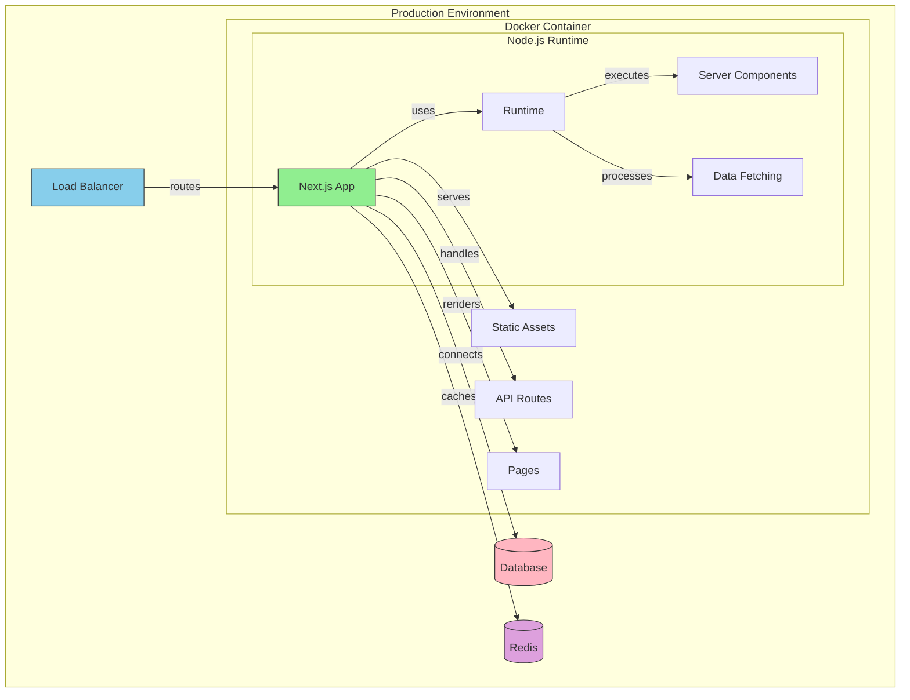
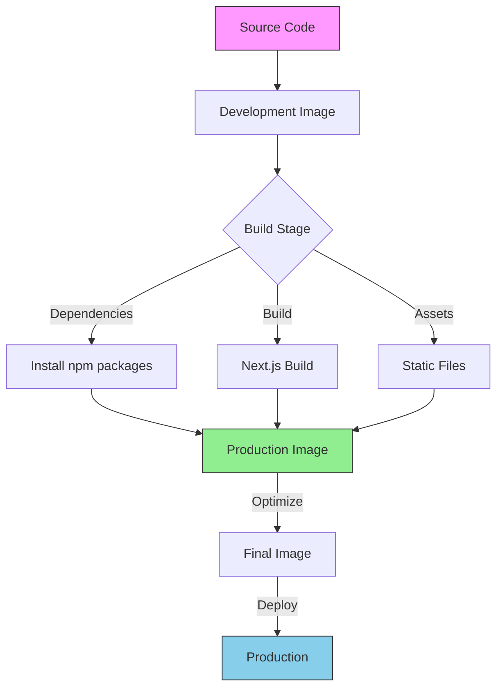
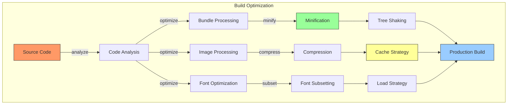
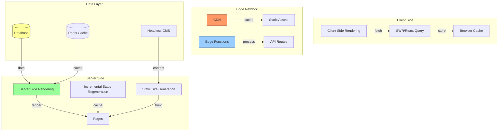
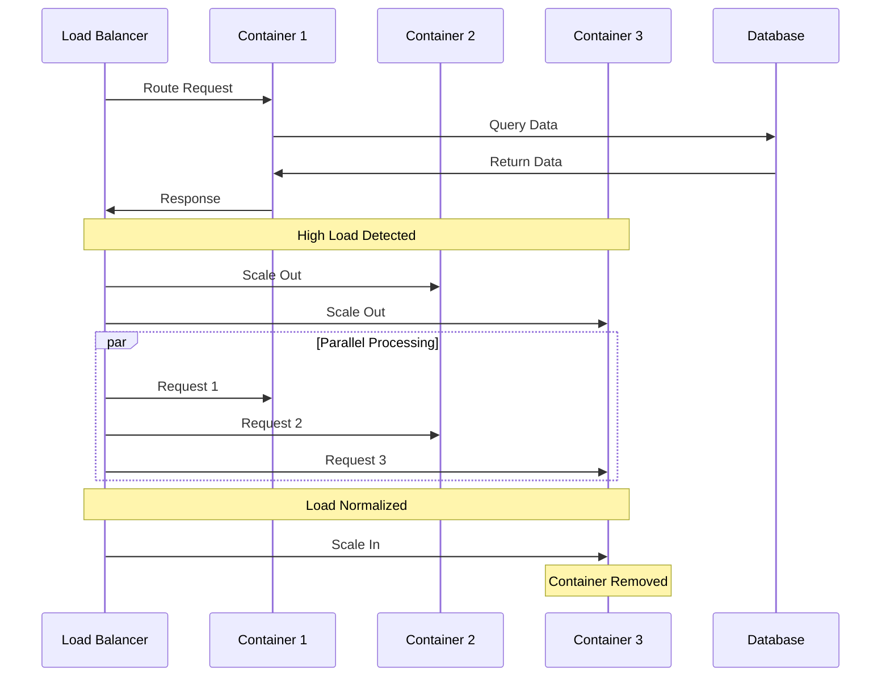

# Next.js Docker Deployment Guide

[← Back to Docker Setup](docker-setup.md) | [Next: CI/CD Setup →](cicd-docker-github.md)

---

## Next.js Docker Architecture



## Build Process



## Table of Contents
1. [Project Structure](#project-structure)
2. [Docker Configuration](#docker-configuration)
3. [Development Setup](#development-setup)
4. [Production Build](#production-build)
5. [Deployment](#deployment)
6. [CI/CD Integration](#cicd-integration)

## Project Structure

### Expected Next.js Project Structure
```plaintext
your-nextjs-app/
├── src/
│   ├── app/
│   ├── components/
│   └── ...
├── public/
├── package.json
├── next.config.js
├── .dockerignore
├── Dockerfile
├── Dockerfile.dev
└── docker-compose.yml
```

### Essential Configuration Files

1. **.dockerignore**
```plaintext
node_modules
.next
.git
.env*.local
```

2. **Dockerfile.dev (Development)**
```dockerfile
FROM node:18-alpine

WORKDIR /app

# Copy package files
COPY package*.json ./

# Install dependencies
RUN npm install

# Copy source
COPY . .

# Expose port
EXPOSE 3000

# Start development server
CMD ["npm", "run", "dev"]
```

3. **Dockerfile (Production)**
```dockerfile
# Build stage
FROM node:18-alpine AS builder

WORKDIR /app

# Copy package files
COPY package*.json ./

# Install dependencies
RUN npm install

# Copy source
COPY . .

# Build application
RUN npm run build

# Production stage
FROM node:18-alpine AS runner

WORKDIR /app

# Copy necessary files from builder
COPY --from=builder /app/package*.json ./
COPY --from=builder /app/.next ./.next
COPY --from=builder /app/public ./public
COPY --from=builder /app/node_modules ./node_modules

# Set environment to production
ENV NODE_ENV=production

# Expose port
EXPOSE 3000

# Start production server
CMD ["npm", "start"]
```

4. **docker-compose.yml**
```yaml
version: '3.8'

services:
  # Development service
  nextjs-dev:
    build:
      context: .
      dockerfile: Dockerfile.dev
    ports:
      - "3000:3000"
    volumes:
      - .:/app
      - /app/node_modules
    environment:
      - NODE_ENV=development
    
  # Production service
  nextjs-prod:
    build:
      context: .
      dockerfile: Dockerfile
    ports:
      - "3000:3000"
    environment:
      - NODE_ENV=production
```

## Development Setup

### Starting Development Environment
```bash
# Build and start development container
docker-compose up nextjs-dev

# View logs
docker-compose logs -f nextjs-dev

# Stop development environment
docker-compose down
```

### Development Best Practices
1. **Hot Reloading**
```yaml
# Add to docker-compose.yml under nextjs-dev service
environment:
  - WATCHPACK_POLLING=true  # Enable hot reloading in Docker
```

2. **Environment Variables**
```yaml
# Add to docker-compose.yml
services:
  nextjs-dev:
    env_file:
      - .env.local
```

## Production Build

### Building Production Image
```bash
# Build production image
docker build -t your-nextjs-app:latest .

# Run production container
docker run -p 3000:3000 your-nextjs-app:latest
```

### Multi-Stage Build Optimization
```dockerfile
# Add to Dockerfile
# Cache dependencies
FROM node:18-alpine AS deps
WORKDIR /app
COPY package*.json ./
RUN npm ci

# Rebuild source code only
FROM node:18-alpine AS builder
WORKDIR /app
COPY --from=deps /app/node_modules ./node_modules
COPY . .
RUN npm run build

# Production image
FROM node:18-alpine AS runner
WORKDIR /app
ENV NODE_ENV=production
COPY --from=builder /app/public ./public
COPY --from=builder /app/.next ./.next
COPY --from=builder /app/node_modules ./node_modules
COPY --from=builder /app/package.json ./package.json
CMD ["npm", "start"]
```

## Deployment

### Docker Registry Push
```bash
# Tag image
docker tag your-nextjs-app:latest your-registry/your-nextjs-app:latest

# Push to registry
docker push your-registry/your-nextjs-app:latest
```

### Server Deployment
```bash
# Pull latest image
docker pull your-registry/your-nextjs-app:latest

# Run with environment variables
docker run -d \
  --name nextjs-production \
  -p 3000:3000 \
  -e DATABASE_URL=your_db_url \
  -e API_KEY=your_api_key \
  your-registry/your-nextjs-app:latest
```

### Using Docker Compose in Production
```yaml
# production.docker-compose.yml
version: '3.8'

services:
  nextjs:
    image: your-registry/your-nextjs-app:latest
    restart: always
    ports:
      - "3000:3000"
    environment:
      - NODE_ENV=production
      - DATABASE_URL=${DATABASE_URL}
      - API_KEY=${API_KEY}
    networks:
      - app-network

networks:
  app-network:
    driver: bridge
```

## CI/CD Integration

### GitHub Actions Example
```yaml
# .github/workflows/docker-deploy.yml
name: Docker Deploy

on:
  push:
    branches: [ main ]

jobs:
  build-and-deploy:
    runs-on: ubuntu-latest
    steps:
      - uses: actions/checkout@v2
      
      - name: Login to Docker Hub
        uses: docker/login-action@v1
        with:
          username: ${{ secrets.DOCKER_HUB_USERNAME }}
          password: ${{ secrets.DOCKER_HUB_ACCESS_TOKEN }}
      
      - name: Build and push
        uses: docker/build-push-action@v2
        with:
          push: true
          tags: your-registry/your-nextjs-app:latest
```

### Automated Deployment Script
```bash
#!/bin/bash
# deploy.sh

# Pull latest image
docker pull your-registry/your-nextjs-app:latest

# Stop existing container
docker stop nextjs-production || true
docker rm nextjs-production || true

# Start new container
docker run -d \
  --name nextjs-production \
  -p 3000:3000 \
  --env-file .env.production \
  your-registry/your-nextjs-app:latest
```

## Performance Optimization

### Docker Image Optimization
1. **Use .dockerignore**
```plaintext
# Add to .dockerignore
.git
.next
node_modules
*.log
.env*
```

2. **Optimize Node Modules**
```dockerfile
# In Dockerfile
RUN npm ci --only=production
```

3. **Cache Optimization**
```dockerfile
# Copy package files first
COPY package*.json ./
RUN npm install
# Then copy source
COPY . .
```

### Production Considerations
1. **Health Checks**
```dockerfile
# Add to Dockerfile
HEALTHCHECK --interval=30s --timeout=30s --start-period=5s --retries=3 \
  CMD curl -f http://localhost:3000/api/health || exit 1
```

2. **Logging Configuration**
```yaml
# In docker-compose.yml
services:
  nextjs:
    logging:
      driver: "json-file"
      options:
        max-size: "10m"
        max-file: "3"
```

## Build Optimization Process



## Deployment Architecture



## Container Scaling



## Next Steps
- Set up monitoring and logging
- Configure CDN and caching
- Implement container orchestration
- Set up backup strategy

---
*This guide will be updated with more detailed sections as we progress.* 