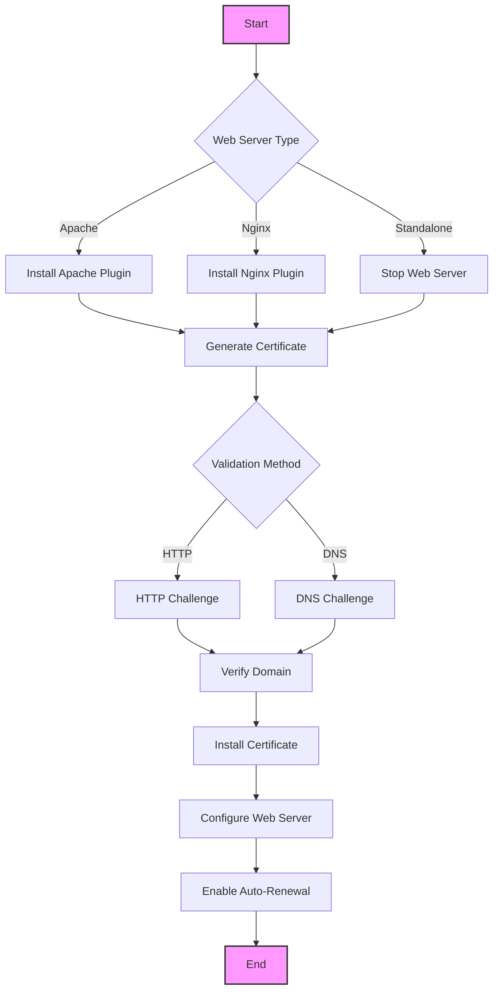
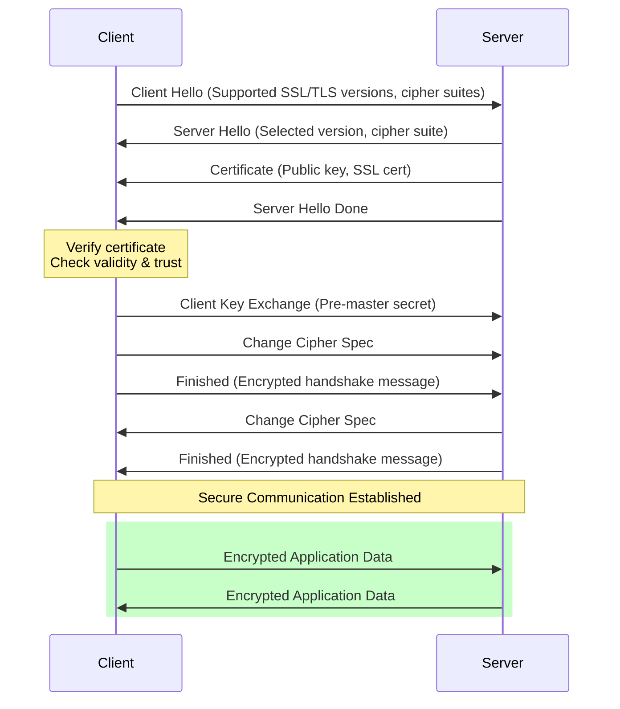
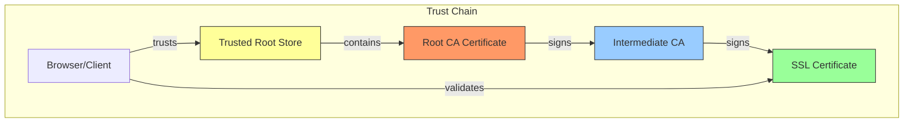
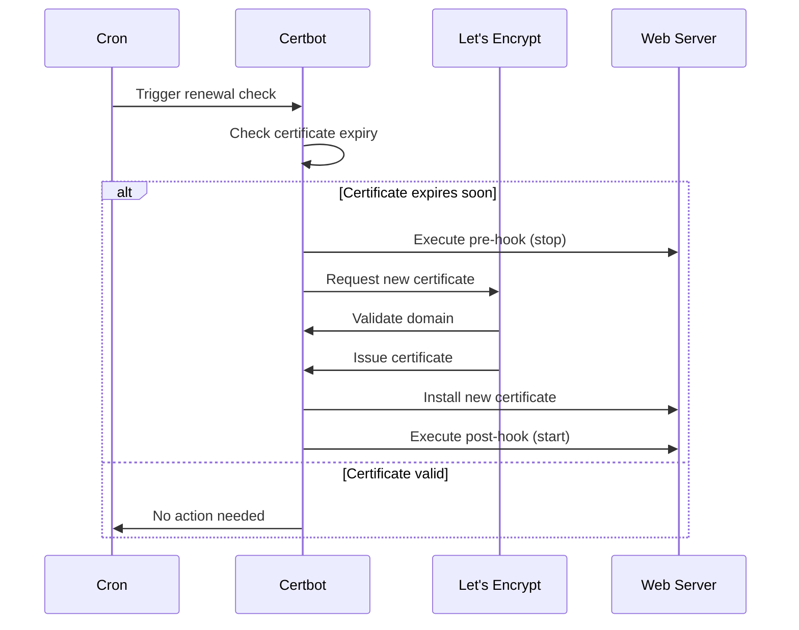

# SSL Certificate and Security Guide

[← Back to SSH Setup](ssh-connection.md) | [Next: Docker Setup →](docker-setup.md)

---

## Certificate Workflow



## SSL Handshake Process



## Certificate Chain Validation



## Auto-Renewal Process



## Table of Contents
1. [SSL Certificate Options](#ssl-certificate-options)
2. [Certbot Installation](#certbot-installation)
3. [Certificate Generation](#certificate-generation)
4. [Auto-Renewal Setup](#auto-renewal-setup)
5. [SSL Configuration](#ssl-configuration)
6. [Security Best Practices](#security-best-practices)
7. [Troubleshooting](#troubleshooting)

## SSL Certificate Options

### Types of SSL Certificates
1. **Let's Encrypt (Free)**
   - Automated certificate management
   - 90-day validity
   - Wildcard certificates supported
   - Rate limits apply
   - Perfect for most websites

2. **Commercial Certificates**
   - Extended Validation (EV)
   - Organization Validation (OV)
   - Domain Validation (DV)
   - Wildcard certificates
   - Multi-domain certificates

### Certificate Selection Guide
- **Use Let's Encrypt when:**
  - Running personal websites
  - Small to medium businesses
  - Need automated renewal
  - Don't require organization validation

- **Use Commercial SSL when:**
  - Running e-commerce sites
  - Need extended validation
  - Require warranty protection
  - Need dedicated support

## Certbot Installation

### Installing Certbot

1. **RHEL/Rocky Linux/CentOS**
   ```bash
   # Install EPEL repository
   sudo dnf install epel-release

   # Install Certbot and plugins
   sudo dnf install certbot python3-certbot-apache python3-certbot-nginx
   ```

2. **Ubuntu/Debian**
   ```bash
   # Install Certbot and plugins
   sudo apt update
   sudo apt install certbot python3-certbot-apache python3-certbot-nginx
   ```

3. **Using Snap (Alternative Method)**
   ```bash
   # Install Snap if not installed
   sudo apt install snapd

   # Install Certbot
   sudo snap install --classic certbot
   sudo ln -s /snap/bin/certbot /usr/bin/certbot
   ```

## Certificate Generation

### Automatic Method (Recommended)

1. **Apache**
   ```bash
   # Obtain and install certificate
   sudo certbot --apache -d example.com -d www.example.com

   # Only obtain certificate
   sudo certbot certonly --apache -d example.com
   ```

2. **Nginx**
   ```bash
   # Obtain and install certificate
   sudo certbot --nginx -d example.com -d www.example.com

   # Only obtain certificate
   sudo certbot certonly --nginx -d example.com
   ```

### Manual Method (DNS Verification)
```bash
# Obtain certificate using DNS challenge
sudo certbot certonly --manual --preferred-challenges dns \
  -d example.com -d *.example.com

# Verify DNS propagation
dig _acme-challenge.example.com TXT
```

### Standalone Mode
```bash
# Stop web server first
sudo systemctl stop nginx

# Obtain certificate
sudo certbot certonly --standalone -d example.com

# Restart web server
sudo systemctl start nginx
```

## Auto-Renewal Setup

### Automatic Renewal Configuration
```bash
# Test automatic renewal
sudo certbot renew --dry-run

# Add to crontab
sudo crontab -e
# Add line:
0 0,12 * * * certbot renew --quiet --deploy-hook "systemctl reload nginx"
```

### Pre and Post Renewal Hooks
```bash
# Create hook directories
sudo mkdir -p /etc/letsencrypt/renewal-hooks/{pre,post,deploy}

# Create pre-renewal hook
cat > /etc/letsencrypt/renewal-hooks/pre/stop-webserver.sh << 'EOF'
#!/bin/bash
systemctl stop nginx
EOF

# Create post-renewal hook
cat > /etc/letsencrypt/renewal-hooks/post/start-webserver.sh << 'EOF'
#!/bin/bash
systemctl start nginx
EOF

# Make hooks executable
chmod +x /etc/letsencrypt/renewal-hooks/{pre,post}/*.sh
```

## SSL Configuration

### Apache Configuration
```apache
# /etc/apache2/sites-available/example.com.conf
<VirtualHost *:443>
    ServerName example.com
    DocumentRoot /var/www/html
    
    SSLEngine on
    SSLCertificateFile /etc/letsencrypt/live/example.com/fullchain.pem
    SSLCertificateKeyFile /etc/letsencrypt/live/example.com/privkey.pem
    
    # Strong SSL Configuration
    SSLProtocol all -SSLv3 -TLSv1 -TLSv1.1
    SSLCipherSuite EECDH+AESGCM:EDH+AESGCM
    SSLHonorCipherOrder on
    
    # Security Headers
    Header always set Strict-Transport-Security "max-age=63072000"
    Header always set X-Frame-Options SAMEORIGIN
    Header always set X-Content-Type-Options nosniff
    Header always set X-XSS-Protection "1; mode=block"
</VirtualHost>
```

### Nginx Configuration
```nginx
# /etc/nginx/sites-available/example.com
server {
    listen 443 ssl http2;
    server_name example.com;
    
    ssl_certificate /etc/letsencrypt/live/example.com/fullchain.pem;
    ssl_certificate_key /etc/letsencrypt/live/example.com/privkey.pem;
    
    # Strong SSL Configuration
    ssl_protocols TLSv1.2 TLSv1.3;
    ssl_prefer_server_ciphers on;
    ssl_ciphers EECDH+AESGCM:EDH+AESGCM;
    ssl_session_cache shared:SSL:10m;
    ssl_session_timeout 10m;
    
    # Security Headers
    add_header Strict-Transport-Security "max-age=63072000" always;
    add_header X-Frame-Options SAMEORIGIN;
    add_header X-Content-Type-Options nosniff;
    add_header X-XSS-Protection "1; mode=block";
    
    # OCSP Stapling
    ssl_stapling on;
    ssl_stapling_verify on;
    resolver 8.8.8.8 8.8.4.4 valid=300s;
    resolver_timeout 5s;
}

# Redirect HTTP to HTTPS
server {
    listen 80;
    server_name example.com;
    return 301 https://$server_name$request_uri;
}
```

## Security Best Practices

### Certificate Security
1. **Private Key Protection**
   ```bash
   # Set correct permissions
   sudo chmod 600 /etc/letsencrypt/live/*/privkey.pem
   sudo chmod 600 /etc/letsencrypt/archive/*/privkey*.pem
   ```

2. **Regular Audits**
   ```bash
   # List all certificates
   sudo certbot certificates

   # Check certificate expiry
   echo | openssl s_client -servername example.com -connect example.com:443 2>/dev/null | openssl x509 -noout -dates
   ```

### SSL/TLS Hardening
```bash
# Generate Strong DH Parameters
sudo openssl dhparam -out /etc/ssl/certs/dhparam.pem 4096

# Add to Nginx configuration
ssl_dhparam /etc/ssl/certs/dhparam.pem;
```

## Troubleshooting

### Common Issues

1. **Certificate Generation Failures**
   ```bash
   # Check Certbot logs
   sudo certbot --logs

   # Verify domain ownership
   sudo certbot certificates

   # Delete failed certificate
   sudo certbot delete --cert-name example.com
   ```

2. **Renewal Issues**
   ```bash
   # Test renewal process
   sudo certbot renew --dry-run --debug

   # Check renewal hooks
   ls -l /etc/letsencrypt/renewal-hooks/{pre,post,deploy}

   # Verify permissions
   sudo chmod -R 755 /etc/letsencrypt/renewal-hooks
   ```

3. **SSL Configuration Testing**
   ```bash
   # Test Apache configuration
   sudo apache2ctl configtest

   # Test Nginx configuration
   sudo nginx -t

   # Test SSL configuration
   openssl s_client -connect example.com:443 -tls1_2
   ```

### SSL Testing Tools
```bash
# Test SSL configuration
curl -vI https://example.com

# Check SSL certificate details
openssl x509 -in /etc/letsencrypt/live/example.com/cert.pem -text -noout

# Verify certificate chain
openssl verify -CAfile /etc/letsencrypt/live/example.com/chain.pem \
    /etc/letsencrypt/live/example.com/cert.pem
```

### Certificate Backup
```bash
# Backup certificates
sudo tar -czf letsencrypt-backup.tar.gz /etc/letsencrypt

# Restore certificates
sudo tar -xzf letsencrypt-backup.tar.gz -C /
```

## Next Steps
- Configure HSTS preload
- Implement OCSP Must-Staple
- Set up automated monitoring
- Configure multi-domain certificates
- Implement automated backup system

## Additional Resources
- [Let's Encrypt Documentation](https://letsencrypt.org/docs/)
- [Mozilla SSL Configuration Generator](https://ssl-config.mozilla.org/)
- [SSL Labs Server Test](https://www.ssllabs.com/ssltest/)
- [Security Headers Scanner](https://securityheaders.com/)

---
*This guide will be updated with more detailed sections as we progress.* 